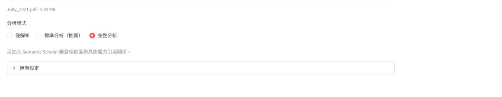
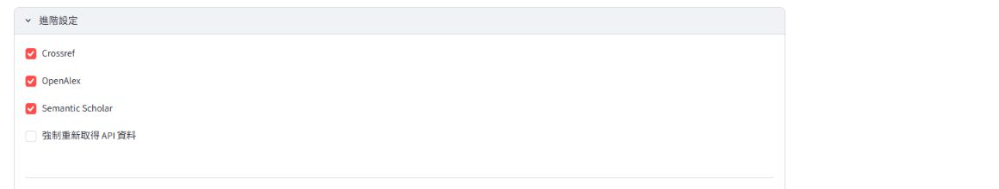
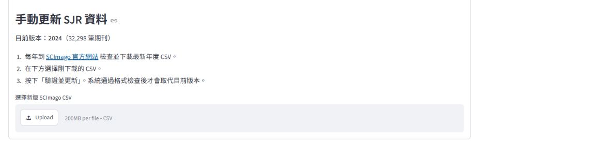
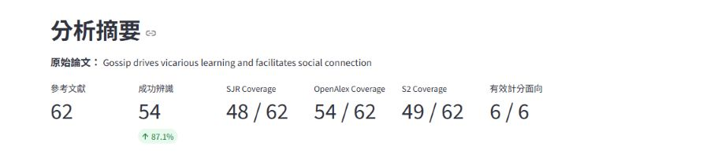
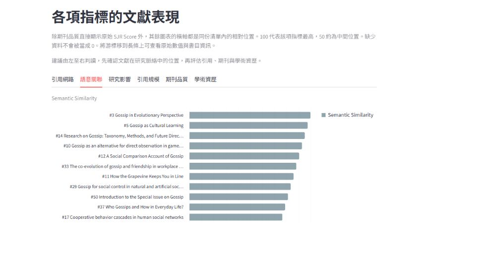
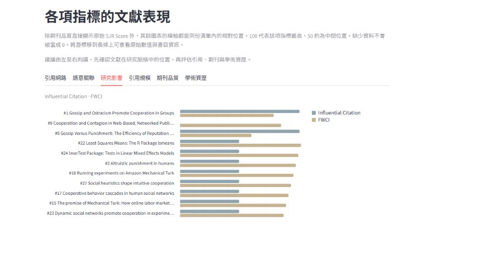
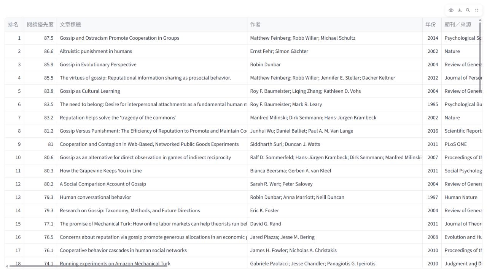
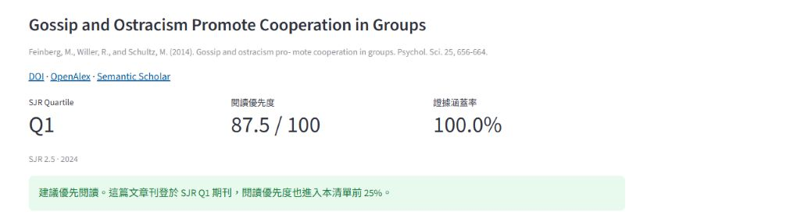
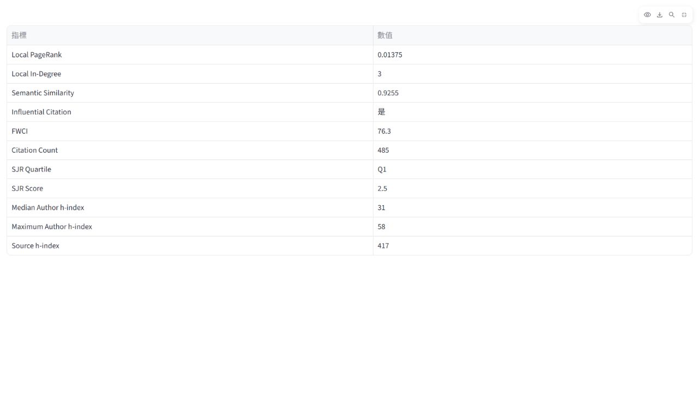
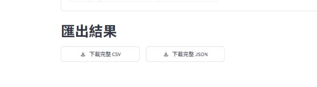

# NextRead Demo 預覽

> 這份預覽使用 `Jolly_2021.pdf` 的既有分析結果。截圖顯示書目資料與分析指標，不包含 PDF 內文；部分畫面沿用舊版介面，操作名稱請以目前程式為準。

## 1. 由基礎解析逐步加入更多分析

介面提供三種分析模式。從「僅解析」到「完整分析」，會逐步加入資料來源與計分面向；GROBID 另在進階設定中選用。

| 分析層級 | 累積開啟的功能 | 何時使用 |
| --- | --- | --- |
| 僅解析 | 從 Crossref 取得參考文獻，或解析上傳的 PDF；不查詢外部指標 | 只需要可搜尋、可匯出的書目資料 |
| 標準分析 | 加入 Crossref 逐筆辨識、OpenAlex 引用指標、SJR 期刊資料與清單內引用關係 | 需要閱讀優先度與主要學術指標時，這是預設選項 |
| 完整分析 | 再加入 Semantic Scholar 語意相似度與具影響力引用關係 | 需要六個計分面向，並可接受較多 API 查詢時間時 |

## 2. 使用進階設定調整資料來源

選擇模式後，介面會預先設定對應的服務；你仍可在進階設定中分別開關 Crossref、OpenAlex 和 Semantic Scholar。「重新查詢外部 API（不使用快取）」會略過這次分析的本機快取，適合排查資料問題或需要取得新回應時使用。下方截圖仍顯示舊版選項名稱。

SJR 資料不會透過 API 即時下載。若有新年度資料，可從 SCImago 下載 CSV，再交由 NextRead 驗證格式並更新本機資料。

## 3. 從摘要確認辨識與指標覆蓋率

在這次對 *Gossip drives vicarious learning and facilitates social connection* 的既有分析中，NextRead 從 PDF 擷取 62 篇參考文獻，其中 54 篇成功辨識；SJR 涵蓋 48 篇、OpenAlex 涵蓋 54 篇、Semantic Scholar 涵蓋 49 篇，六個計分面向均有資料。缺少的指標不計作 0 分；覆蓋率可用來判斷排序依據是否充分。

## 4. 分開查看每個計分面向

「語意關聯」顯示參考文獻與原始論文的 Semantic Similarity；「研究影響」顯示 Influential Citation 和 FWCI。SJR Score 保留原始尺度，其餘長條圖的 0–100 表示文獻在這份清單中的相對位置。將游標移到長條上，可查看原始數值與書目資料。

## 5. 依閱讀優先度瀏覽參考文獻

排序表根據可用指標計算 Reading Priority，優先度越高的文獻排得越前。全螢幕模式可同時查看更多欄位；也可以捲動表格，或匯出 CSV、JSON 查看完整清單。

## 6. 展開單篇文獻的計分依據

以 Jolly 2021 清單中的 *Gossip and Ostracism Promote Cooperation in Groups* 為例：這篇文獻的 SJR Quartile 為 Q1、Reading Priority 為 87.5、證據涵蓋率為 100%。介面也提供 DOI、OpenAlex 和 Semantic Scholar 連結，方便進一步核對。

展開原始指標，可核對各項計分依據：Local PageRank 0.01375、Local In-Degree 3、Semantic Similarity 0.9255、Influential Citation 是、FWCI 76.3、Citation Count 485、SJR Quartile Q1、SJR Score 2.5、Median Author h-index 31、Maximum Author h-index 58，以及 Source h-index 417。

## 7. 匯出完整結果

CSV 適合用試算表篩選、排序和繪圖；JSON 保留結構化欄位，方便交給其他程式或 agent 處理。

